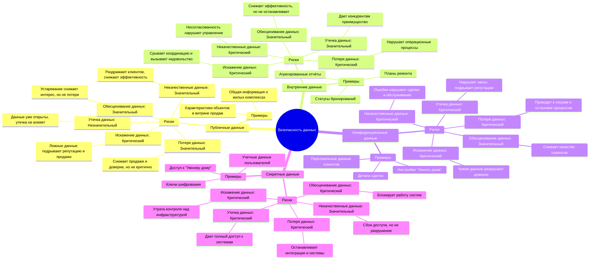

# Отчёт по выполнению задания 1: Разработка проверочного листа по безопасности данных

# Общая информация о компании
PropDevelopment — крупная строительная компания, входящая в топ-3 застройщиков страны. Основной фокус — предоставление услуг по покупке недвижимости и обслуживанию жилых комплексов для частных клиентов. Клиенты делятся на две категории:
- **Клиенты** (потенциальные покупатели жилья).
- **Собственники** (владельцы приобретённой недвижимости).

## Услуги и IT-продукты
- **Для клиентов:**
    - Онлайн-витрина для подбора и бронирования недвижимости.
    - Онлайн-тур (приложение для осмотра жилья без посещения).
    - Онлайн-сделка (приложение для покупки недвижимости онлайн).
- **Для собственников:**
    - Мобильное приложение с функциями:
        - Оплата услуг ЖКХ.
        - Информация от управляющей компании.
        - Мониторинг текущего и капитального ремонта.
        - Управление системой "Умный дом" (автоматика, замки).

---

## Текущая архитектура системы
Архитектура PropDevelopment организована по доменной структуре, где каждый домен отвечает за определённую часть бизнеса и включает продуктовые команды. Всего выделено четыре домена.

### Домены и их сервисы
1. **Группа сервисов для продаж (клиентские сервисы):**
    - **Витрина продаж (sales_showcase)**: JavaScript, React — подбор и бронирование недвижимости.
    - **client-tour-app**: Kotlin, SpringBoot — онлайн-туры, база данных PostgreSQL (client-tour-db).
    - **client-mart-app**: Kotlin, SpringBoot — онлайн-сделки, база данных PostgreSQL (client-mart-db).
    - **client-crm-app**: SpringBoot, ElasticSearch, Dynamics CRM — управление клиентскими данными, база данных MSSQL (crm-db).
    - **client-mart-estate-app**: Kotlin, SpringBoot — управление данными о недвижимости, база данных PostgreSQL (client-mart-estate-db).
    - **auth-service-1**: Keycloak — аутентификация покупателей, база данных PostgreSQL (auth-db-1).

2. **Группа сервисов ЖКУ (услуги для собственников):**
    - **Витрина сервисов (owner_services_showcase)**: Мобильное приложение (iOS, Android) — интерфейс для собственников.
    - **tenant-core-app**: Kotlin, SpringBoot — предоставление услуг, база данных PostgreSQL (tenant-core-db).
    - **CRM**: Kotlin, SpringBoot — управление данными собственников, база данных PostgreSQL (crm-tenant-db).

3. **Финансы:**
    - **accountant-service-1**: Keycloak — система бухгалтерского учёта, база данных PostgreSQL (accountant-service-db).
    - **Active Directory**: Служба каталогов для финансовых и бизнес-систем.

4. **Дата:**
    - **Хранилище данных (DWH)**: Greenplum — единое хранилище данных.
    - **DWH Storage**: S3 — физическое хранилище.
    - BI и отчётность для аналитиков.

### 2.2. Взаимодействия в системе
- **Клиенты** взаимодействуют с витриной продаж через брандмауэр (firewall_client) по REST.
- **Собственники** используют витрину ЖКУ через брандмауэр (firewall_utility) по REST.
- **Интеграции:**
    - client-mart-app → Государственные органы (SOAP, СМЭВ) для сделок.
    - owner_services_showcase → Платёжные системы (REST, WS) и поставщики ЖКУ (REST).
- **Передача данных:**
    - Базы данных (client-mart-db, tenant-core-db, crm-db и др.) → DWH через CDC (Change Data Capture).
    - Внутри систем: REST, JDBC, Kafka, LDAP.

### 2.3. Диаграмма контейнеров (C4)
Диаграмма C4 представлена в формате PlantUML и включает пользователей, внешние системы, брандмауэры и внутренние компоненты PropDevelopment (см. исходное описание).
```plantuml
@startuml
!include https://raw.githubusercontent.com/vasilokb/plantUML/refs/heads/main/C4.puml

' Определение пользователей

Boundary(users, "Пользователи") {
Person(client, "Клиент", "Клиент")
Person(accountant, "Бухгалтер", "Ведёт бухгалтерский учёт")
Person(owner, "Собственник", "Клиент")
Person(manager, "Менеджер", "Работает с клиентами и объектами недвижимости, администрирует онлайн-сделки")
Person(ba_analyst, "Бизнес-аналитик", "Оптимизирует процессы и развивает прикладные бизнес-системы. Администрирует системы")
Person(bi_analyst, "Aналитик BI", "Анализирует данные и готовит отчётность")

}
' Определение внешних систем
Boundary(outer_systems, "Внешние системы") {
System(utility_provider, "Поставщик ресурсов ЖКХ", "Внешняя система") #lightgrey
System(payment_system, "Платёжная система", "Провайдер онлайн-платежей") #lightgrey
System(gov_reg_authorities, "Государственные регистрационные органы", "Отвечают за регистрационные действия с объектами недвижимости") #lightgrey
}

' Определение брандмауэров
System(firewall_client, "Брандмауэр клиентов", "Фильтрует трафик для клиентских сервисов") #red
System(firewall_utility, "Брандмауэр ЖКУ", "Фильтрует трафик для сервисов ЖКУ") #red

' Основная граница системы
Boundary(prop_development, "PropDevelopment [Система недвижимости]") {
System(active_directory, "Active Directory", "MS Active Directory, служба каталогов для финансовых и бизнес-систем")

    ' Группа сервисов для клиентов
    Boundary(client_services, "Группа сервисов для клиентов") {
        Container(sales_showcase, "Витрина продаж", "Витрина: JavaScript, React, подбор и бронирование объектов недвижимости", , , , "JavaScript, React") #lightblue
        Container(client_mart_app, "client-mart-app", "Приложение: Kotlin, SpringBoot, предоставление информации об объектах недвижимости, проведение онлайн-сделок", , , , "Kotlin, SpringBoot")
        ContainerDb(client_mart_db, "client-mart-db", "База данных: PostgreSQL, информация об объектах недвижимости и сделки", , , , "PostgreSQL") #grey
        Container(client_mart_estate_app, "client-mart-estate-app", "Приложение: Kotlin, SpringBoot, управление информацией об объектах недвижимости", , , , "Kotlin, SpringBoot")
        ContainerDb(client_mart_estate_db, "client-mart-estate-db", "База данных: PostgreSQL, объекты недвижимости", , , , "PostgreSQL") #grey
        Container(client_tour_app, "client-tour-app", "Приложение: Kotlin, SpringBoot, проведение 3D-тура по объекту недвижимости (онлайн-тур)", , , , "Kotlin, SpringBoot")
        ContainerDb(client_tour_db, "client-tour-db", "База данных: PostgreSQL, проведение онлайн-тура", , , , "PostgreSQL") #grey
        Container(client_crm_app, "client-crm-app", "Приложение: SpringBoot, ElasticSearch, Dynamics CRM, управление клиентскими данными", , , , "SpringBoot, ElasticSearch, Dynamics CRM") 
        ContainerDb(crm_db, "crm-db", "База данных: MSSQL, система CRM", , , , "MSSQL") #grey
        }
 Container(auth_service_1, "auth-service-1", "Сервис: Keycloak, аутентификация покупателей", , , , "Keycloak") #lightblue
        ContainerDb(auth_db_1, "auth-db-1", "База данных: PostgreSQL, сервис аутентификации покупателей", , , , "PostgreSQL") #grey

    ' Группа сервисов ЖКУ
    Boundary(utility_services, "Группа сервисов ЖКУ") {
        Container(owner_services_showcase, "Витрина сервисов для собственников", "Витрина: Mobile app (iOS, Android), мобильные приложения для собственников", , , , "Mobile app (iOS, Android)") #lightblue
        Container(tenant_core_app, "tenant-core-app", "Приложение: Kotlin, SpringBoot, предоставление услуг собственникам", , , , "Kotlin, SpringBoot")
        ContainerDb(tenant_core_db, "tenant-core-db", "База данных: PostgreSQL, услуги ЖКХ по собственникам", , , , "PostgreSQL") #grey
        Container(crm, "CRM", "Приложение: Kotlin, SpringBoot, управление данными собственников", , , , "Kotlin, SpringBoot")
        ContainerDb(crm_tenant_db, "crm-tenant-db", "База данных: PostgreSQL, CRM по собственникам", , , , "PostgreSQL") #grey
    }

    ' Бухгалтерия
    Boundary(accounting, "Бухгалтерия") {
        Container(accountant_service_1, "accountant-service-1", "Сервис: Keycloak, система бухгалтерского учёта", , , , "Keycloak") #lightblue
        ContainerDb(accountant_service_db, "accountant-service-db", "База данных: PostgreSQL, сервис аутентификации покупателей", , , , "PostgreSQL") #grey

    }
}

' Хранилище данных
Boundary(data_warehouse, "Хранилище данных") {
    Container(dwh, "Хранилище данных", "Хранилище: Greenplum, единое хранилище данных для всех систем компании", , , , "Greenplum") #lightblue
    ContainerDb(dwh_storage, "DWH Хранилище", "Хранилище: S3, физическое хранилище данных DWH", , , , "S3") #grey
}

' Определение связей
' Клиент и Собственник через брандмауэры
Rel(client, firewall_client, "Взаимодействие", "REST")
Rel(firewall_client, sales_showcase, "Отфильтрованное взаимодействие", "REST")
Rel(owner, firewall_utility, "Взаимодействие", "REST")
Rel(firewall_utility, owner_services_showcase, "Отфильтрованное взаимодействие", "REST")

' Менеджер
Rel(manager, prop_development, "РРаботает с клиентами и объектами недвижимости, администрирует онлайн-сделки", "REST")

' Бизнес-аналитик
Rel(ba_analyst, prop_development, "Оптимизирует процессы и развивает прикладные бизнес-системы. Администрирует системы", "SQL")

' Бухгалтер
Rel(accountant, accountant_service_1, "Бухгалтерский учёт", "REST")
Rel(accountant_service_1, accountant_service_db, "Данные Бухгалтерского учета", "TCP")
Rel(accountant_service_1, active_directory, "Аутентификация", "LDAP")

' Взаимодействия внутри системы
Rel(sales_showcase, auth_service_1, "Регистрация, Аутентификация", "REST")
Rel(sales_showcase, client_mart_app, "Получение данных по объектам недвижимости", "REST")
Rel(sales_showcase, client_tour_app, "Онлайн-тур", "REST")
Rel(client_mart_app, client_mart_db, "Хранение данных", "JDBC")
Rel(sales_showcase, client_crm_app, "Регистрация клиента, карточка клиента, профиль клиента", "REST")
Rel( client_crm_app,client_mart_app, "Получение данных по сделкам клиента", "REST")
Rel( client_crm_app,client_tour_app, "Получение данных по показам объекта клиенту", "REST")
Rel(client_mart_app, gov_reg_authorities, "СМЭВ", "SOAP")
Rel(client_mart_estate_app, client_mart_db, "Публикация каталога объектов", "Kafka")
Rel(client_mart_estate_app, client_mart_estate_db, "Хранение данных", "JDBC")
Rel(client_tour_app, client_tour_db, "Хранение данных", "JDBC")
Rel(client_crm_app, crm_db, "Хранение данных", "JDBC")
Rel(client_crm_app, active_directory, "Аутентификация менеджеров", "LDAP")
Rel(auth_service_1, auth_db_1, "Хранение данных", "TCP")
Rel(auth_service_1, active_directory, "Аутентификация", "LDAP")
Rel(owner_services_showcase, auth_service_1, "Аутентификация", "REST")
Rel(owner_services_showcase, tenant_core_app, "Услуги для собственников", "REST")
Rel(owner_services_showcase, crm, "Управление данными", "REST")
Rel(owner_services_showcase, payment_system, "Оплата", "REST, WS")
Rel(owner_services_showcase, utility_provider, "Услуги ЖКХ", "REST")
Rel(tenant_core_app, tenant_core_db, "Хранение данных", "JDBC")
Rel(tenant_core_app, crm, "Получение клиентских данных", "REST")
Rel(crm, crm_tenant_db, "Хранение данных", "JDBC")
Rel(crm, active_directory, "Аутентификация менеджеров", "LDAP")

' Передача данных в DWH
Rel(client_mart_db, dwh, "Передача сырых данных", "CDC")
Rel(client_mart_estate_db, dwh, "Передача сырых данных", "CDC")
Rel(crm_db, dwh, "Передача сырых данных", "CDC")
Rel(tenant_core_db, dwh, "Передача сырых данных", "CDC")
Rel(crm_tenant_db, dwh, "Передача сырых данных", "CDC")
Rel(bi_analyst, dwh, "Хранение данных", "SQL")
Rel(dwh, dwh_storage, "Хранение данных", "TCP")
Rel(dwh, active_directory, "Аутентификация аналитика", "LDAP")

@enduml
```
---

## Инфраструктура
- **Развёртывание:** Большинство сервисов на собственных серверах, часть — в гибридной модели (приватное облако + арендованные мощности).
- **ЦОД:** Собственный центр обработки данных + облачные ресурсы для масштабирования на этапах доработки и тестирования.
- **Резервное копирование:** Выполняется для всех баз данных с глубиной, достаточной для восстановления.
- **Доступ:** Внешние пользователи (клиенты, собственники) подключаются через межсетевые экраны (firewall_client, firewall_utility).

---

## Структура команд
- **Продуктовая команда:**
    - **Функциональная:** Владелец продукта, бизнес-аналитики, разработчики, инженеры по эксплуатации, DevOps-инженер — разработка и поддержка IT-продуктов.
    - **Операционная:** Менеджеры — использование продуктов в операционной деятельности.
- **Специалист по ИБ:** Один на всю компанию, недавно возникли проблемы с передачей информации из-за смены руководства IT-команд.

---

## Проблемы и потребности бизнеса
### Основные проблемы
1. **Нарушение контроля данных:**
    - Множество точек регистрации клиентов без координации.
    - Несистемный контроль внутренних потоков данных.
2. **Проблемы с API партнёров:**
    - Отсутствие единых политик безопасности.
    - Передача избыточных данных, включая персональные.
    - Доступ партнёров к данным других управляющих компаний.

### Потребности бизнеса
- Повышение удовлетворённости клиентов (устранение ошибок в личных кабинетах).
- Развитие обработки данных для BI, ML, AI (ограничено текущими проблемами).
- Предотвращение инцидентов (реакция на утечку у конкурента).
- Соответствие законодательству РФ (проверка бизнес-процессов).

---


# Шаг 1. Классификация данных


## 1. Публичные данные
Это данные, которые предназначены для общего доступа и не требуют особой защиты, так как их раскрытие не наносит вреда компании или пользователям.

- **Примеры из PropDevelopment:**
    - Информация о доступных объектах недвижимости в **витрине продаж (sales_showcase)** — общие характеристики объектов (площадь, расположение, стоимость), которые публикуются для потенциальных покупателей.
    - Общая информация о жилых комплексах, доступная через **витрину сервисов для собственников (owner_services_showcase)**, например, описание инфраструктуры или рекламные материалы.
    - Данные для маркетинговых целей, которые публикуются на сайте или в приложениях (без привязки к конкретным клиентам или сделкам).

- **Обоснование:** Эти данные открыты для всех пользователей и не содержат персональной или чувствительной информации. Они предназначены для привлечения клиентов и не требуют ограничения доступа.

---

## 2. Внутренние данные
Данные, используемые внутри компании для операционной деятельности. Их раскрытие может повлиять на эффективность работы, но не несёт прямых рисков для клиентов или соблюдения законодательства.

- **Примеры из PropDevelopment:**
    - Данные о статусе бронирований в **client-mart-app** (без персональных данных клиента), например, количество забронированных объектов или их текущая доступность.
    - Информация о запланированных работах по текущему и капитальному ремонту в **tenant-core-app**, доступная только собственникам и менеджерам (без указания персональных данных).
    - Операционные данные в **client-mart-estate-app**, такие как внутренние метки объектов недвижимости (например, статус "в продаже", "забронировано", "продано").
    - Отчёты для бизнес-аналитиков из **DWH (хранилище данных)** в агрегированном виде, без привязки к конкретным клиентам или собственникам.

- **Обоснование:** Эти данные используются для управления процессами внутри компании и её продуктов. Они не предназначены для публичного доступа, но их утечка не приведёт к серьёзным последствиям, если не содержит конфиденциальной информации.

---

## 3. Конфиденциальные данные
Данные, которые требуют защиты из-за их чувствительности. Утечка может привести к нарушению конфиденциальности клиентов, репутационным потерям или нарушению законодательства (например, закона о персональных данных).

- **Примеры из PropDevelopment:**
    - Персональные данные клиентов из **client-crm-app** и **crm-db**: ФИО, телефон, электронная почта, данные из расширенной формы (например, паспортные данные или финансовая информация для сделок).
    - Персональные данные собственников в **crm (CRM для собственников)** и **crm-tenant-db**: ФИО, адрес проживания, контактные данные.
    - Информация о сделках в **client-mart-app** и **client-mart-db**: детали онлайн-сделок, включая стоимость, условия покупки и даты.
    - Данные о подключении к системе "Умный дом" в **tenant-core-app** и **tenant-core-db**: настройки автоматики, информация о доступе к устройствам (например, коды замков).
    - Финансовые данные из **accountant-service-1** и **accountant-service-db**: информация о платежах за ЖКУ, бухгалтерские отчёты, связанные с клиентами и собственниками.

- **Обоснование:** Эти данные относятся к персональной информации (PII — Personally Identifiable Information) или финансовым сведениям, которые регулируются законодательством (например, ФЗ-152 в РФ). Их утечка может привести к юридическим последствиям, потере доверия клиентов и штрафам.

---

## 4. Секретные данные
Данные с наивысшим уровнем чувствительности, утечка которых может нанести критический ущерб компании, её клиентам или партнёрам. Обычно это данные, связанные с безопасностью систем или критическими бизнес-процессами.

- **Примеры из PropDevelopment:**
    - Учетные данные пользователей (логины, пароли, токены) в **auth-service-1** и **auth-db-1**, используемые для аутентификации клиентов, собственников и сотрудников.
    - Ключи шифрования и сертификаты, используемые для интеграции с **государственными регистрационными органами (gov_reg_authorities)** через **client-mart-app** (например, для СМЭВ).
    - Данные о доступе к системе "Умный дом" в **tenant-core-app**, такие как мастер-коды или ключи для управления замками и автоматикой на уровне жилого комплекса.
    - Внутренние данные аудита безопасности и конфигурации межсетевых экранов (**firewall_client**, **firewall_utility**), которые фильтруют трафик.
    - Полные дампы баз данных (**client-mart-db**, **tenant-core-db**, **crm-db**, **crm-tenant-db**) при передаче в **DWH** через CDC (Change Data Capture), если они содержат неагрегированные персональные данные.

- **Обоснование:** Эти данные критически важны для безопасности систем и пользователей. Их компрометация может привести к несанкционированному доступу к системам, полной утечке данных или нарушению работы инфраструктуры компании. Они требуют максимального уровня защиты (например, шифрования и строгого контроля доступа).

---

### Итоговая классификация
| Категория            | Примеры данных                                                                 | Источник в системе                          |
|----------------------|-------------------------------------------------------------------------------|---------------------------------------------|
| **Публичные**        | Объекты недвижимости, рекламные материалы                                     | sales_showcase, owner_services_showcase     |
| **Внутренние**       | Статусы бронирований, планы ремонта, агрегированные отчёты                    | client-mart-app, tenant-core-app, DWH       |
| **Конфиденциальные** | Персональные данные клиентов и собственников, детали сделок, финансы          | client-crm-app, crm, client-mart-db         |
| **Секретные**        | Учетные данные, ключи шифрования, доступ к "Умному дому", конфигурация систем | auth-service-1, tenant-core-app, firewalls  |

---

## Шаг 2. Определение рисков

## 1. Публичные данные
**Примеры:** Характеристики объектов недвижимости в витрине продаж, общая информация о жилых комплексах.

| Риск                  | Описание                                                                                   | Вероятность и последствия                                                                 |
|-----------------------|-------------------------------------------------------------------------------------------|-------------------------------------------------------------------------------------------|
| **Утечка данных**     | Данные уже публичны, поэтому утечка невозможна в традиционном смысле.                     | Низкая вероятность, минимальные последствия — данные и так доступны всем.                 |
| **Потеря данных**     | Удаление или недоступность данных о недвижимости в витрине продаж.                        | Средняя вероятность (сбой сервера/ЦОД), умеренные последствия — снижение доверия клиентов. |
| **Искажение данных**  | Изменение характеристик объектов (например, площади или цены) в витрине.                  | Средняя вероятность (человеческий фактор, атака), высокие последствия — дезинформация клиентов. |
| **Некачественные данные** | Неполные или устаревшие данные об объектах (например, проданная квартира числится свободной). | Высокая вероятность (отсутствие синхронизации), умеренные последствия — недовольство клиентов. |
| **Обесценивание данных** | Данные теряют актуальность из-за устаревания (например, акции закончились).              | Высокая вероятность (временной фактор), умеренные последствия — снижение интереса к витрине. |

**Комментарий:** Основные риски связаны с качеством и актуальностью данных, так как они влияют на клиентский опыт. Утечка неактуальна, так как данные публичны.

---

## 2. Внутренние данные
**Примеры:** Статусы бронирований, планы ремонта, агрегированные отчёты из DWH.

| Риск                  | Описание                                                                                   | Вероятность и последствия                                                                 |
|-----------------------|-------------------------------------------------------------------------------------------|-------------------------------------------------------------------------------------------|
| **Утечка данных**     | Несанкционированный доступ к статусам бронирований или планам ремонта.                    | Средняя вероятность (слабый контроль доступа), умеренные последствия — утечка операционных планов. |
| **Потеря данных**     | Удаление данных о бронированиях или истории ремонтов из-за сбоя БД.                       | Средняя вероятность (сбой инфраструктуры), высокие последствия — нарушение процессов.      |
| **Искажение данных**  | Ошибочные статусы бронирований или планы ремонта (например, неверные даты).               | Средняя вероятность (человеческий фактор), высокие последствия — срыв процессов и недовольство собственников. |
| **Некачественные данные** | Несогласованные данные между системами (например, разные статусы в витрине и CRM).       | Высокая вероятность (отсутствие координации), высокие последствия — ошибки в управлении.   |
| **Обесценивание данных** | Устаревание планов ремонта или отчётов, если их не обновлять вовремя.                   | Средняя вероятность (временной фактор), умеренные последствия — снижение эффективности.    |

**Комментарий:** Риски связаны с операционной деятельностью. Некачественные данные и их искажение могут серьёзно повлиять на координацию между командами и продуктами.

---

## 3. Конфиденциальные данные
**Примеры:** Персональные данные клиентов и собственников, детали сделок, настройки "Умного дома".

| Риск                  | Описание                                                                                   | Вероятность и последствия                                                                 |
|-----------------------|-------------------------------------------------------------------------------------------|-------------------------------------------------------------------------------------------|
| **Утечка данных**     | Несанкционированный доступ к ФИО, паспортным данным, деталям сделок через API или БД.      | Высокая вероятность (проблемы с API партнёров, слабый контроль), критические последствия — нарушение законодательства, репутационные потери. |
| **Потеря данных**     | Удаление данных о сделках или платежах ЖКУ из-за сбоя или ошибки резервного копирования.   | Средняя вероятность (сбой инфраструктуры), высокие последствия — юридические споры, недовольство клиентов. |
| **Искажение данных**  | Изменение данных клиента (например, ФИО другого человека в личном кабинете).              | Высокая вероятность (ошибки интеграции), критические последствия — жалобы клиентов, путаница в сделках. |
| **Некачественные данные** | Дубликаты клиентов или несогласованные данные между CRM и другими системами.            | Высокая вероятность (множество точек регистрации), высокие последствия — ошибки в обслуживании. |
| **Обесценивание данных** | Устаревание контактных данных клиентов или настроек "Умного дома".                      | Средняя вероятность (временной фактор), умеренные последствия — снижение качества сервисов. |

**Комментарий:** Утечка и искажение данных — ключевые риски из-за проблем с API партнёров и отсутствия системного контроля. Это подтверждается жалобами клиентов на ошибки в личных кабинетах.

---

## 4. Секретные данные
**Примеры:** Учетные данные пользователей, ключи шифрования, доступ к "Умному дому".

| Риск                  | Описание                                                                                   | Вероятность и последствия                                                                 |
|-----------------------|-------------------------------------------------------------------------------------------|-------------------------------------------------------------------------------------------|
| **Утечка данных**     | Компрометация учетных данных или ключей шифрования через уязвимости в auth-service-1.      | Высокая вероятность (слабые политики безопасности), катастрофические последствия — полный доступ к системам и данным. |
| **Потеря данных**     | Утрата ключей шифрования или конфигурации firewall из-за сбоя без восстановления.          | Низкая вероятность (резервное копирование), катастрофические последствия — остановка систем. |
| **Искажение данных**  | Изменение учетных данных или мастер-кодов "Умного дома" злоумышленником.                   | Средняя вероятность (атака на системы), катастрофические последствия — утрата контроля над инфраструктурой. |
| **Некачественные данные** | Ошибки в токенах аутентификации или настройках доступа из-за несогласованности систем.    | Средняя вероятность (человеческий фактор), высокие последствия — сбои в доступе для пользователей. |
| **Обесценивание данных** | Устаревание сертификатов или ключей шифрования без своевременного обновления.            | Средняя вероятность (временной фактор), высокие последствия — прекращение интеграций (например, с госорганами). |

**Комментарий:** Утечка и искажение секретных данных — наиболее опасные риски, так как они могут привести к полной компрометации систем, включая "Умный дом" и интеграции с госорганами.

---

### Итоговая таблица рисков

| Категория            | Утечка данных          | Потеря данных          | Искажение данных       | Некачественные данные  | Обесценивание данных   |
|----------------------|------------------------|------------------------|------------------------|------------------------|------------------------|
| **Публичные**        | Низкая/Минимальные     | Средняя/Умеренные      | Средняя/Высокие        | Высокая/Умеренные      | Высокая/Умеренные      |
| **Внутренние**       | Средняя/Умеренные      | Средняя/Высокие        | Средняя/Высокие        | Высокая/Высокие        | Средняя/Умеренные      |
| **Конфиденциальные** | Высокая/Критические    | Средняя/Высокие        | Высокая/Критические    | Высокая/Высокие        | Средняя/Умеренные      |
| **Секретные**        | Высокая/Катастрофические | Низкая/Катастрофические | Средняя/Катастрофические | Средняя/Высокие       | Средняя/Высокие        |

---

### Выводы
- **Публичные данные:** Основной риск — качество и актуальность, а не безопасность.
- **Внутренние данные:** Риски связаны с операционной стабильностью и синхронизацией.
- **Конфиденциальные данные:** Высокий риск утечки и искажения из-за проблем с API и контроля данных.
- **Секретные данные:** Утечка и искажение — критические угрозы для всей инфраструктуры.

# Шаг 3. Обоснование актуальности рисков


## 1. Публичные данные
**Примеры:** Характеристики объектов недвижимости в витрине продаж, общая информация о жилых комплексах.  
**Ключевые риски:** Некачественные данные (высокая вероятность/умеренные последствия), Искажение данных (средняя вероятность/высокие последствия), Обесценивание данных (высокая вероятность/умеренные последствия).

- **Некачественные данные (высокая вероятность/умеренные последствия):**
    - **Почему актуально:** В витрине продаж (sales_showcase) клиенты выбирают и бронируют недвижимость. Если данные неполные или устаревшие (например, квартира числится свободной, но уже продана), это приводит к ошибкам в бронировании и недовольству клиентов. Отсутствие системной синхронизации между витриной и client-mart-app (где хранятся актуальные данные о сделках) увеличивает вероятность таких ошибок.
    - **Контекст:** Описание системы не указывает строгих механизмов проверки данных перед публикацией в витрине, что делает этот риск реальным.

- **Искажение данных (средняя вероятность/высокие последствия):**
    - **Почему актуально:** Если данные в витрине (например, цена или площадь объекта) искажены из-за человеческого фактора или атаки, клиенты получат ложную информацию. Это может привести к репутационным потерям и потере доверия. Внешний доступ через firewall_client повышает уязвимость к атакам.
    - **Контекст:** Публичные данные — первая точка контакта с клиентами, и их достоверность критична для бизнеса.

- **Обесценивание данных (высокая вероятность/умеренные последствия):**
    - **Почему актуально:** Данные о недвижимости быстро устаревают (например, акции заканчиваются, объекты продаются). Без регулярного обновления витрина теряет актуальность, что снижает интерес клиентов.
    - **Контекст:** Высокая динамика рынка недвижимости делает этот риск естественным для публичных данных.

- **Почему другие риски менее актуальны:** Утечка не имеет смысла (данные уже открыты), а потеря данных (сбой сервера) менее вероятна благодаря резервному копированию и умеренно влияет на бизнес.

---

## 2. Внутренние данные
**Примеры:** Статусы бронирований, планы ремонта, агрегированные отчёты из DWH.  
**Ключевые риски:** Некачественные данные (высокая вероятность/высокие последствия), Искажение данных (средняя вероятность/высокие последствия), Потеря данных (средняя вероятность/высокие последствия).

- **Некачественные данные (высокая вероятность/высокие последствия):**
    - **Почему актуально:** Описание системы указывает на отсутствие координации между точками регистрации данных (например, между client-crm-app и client-mart-app). Это приводит к несогласованности статусов бронирований или планов ремонта в tenant-core-app, что нарушает операционные процессы (например, менеджеры работают с устаревшими данными).
    - **Контекст:** Проблема контроля данных, упомянутая в потребностях бизнеса, напрямую связана с этим риском.

- **Искажение данных (средняя вероятность/высокие последствия):**
    - **Почему актуально:** Ошибки ввода или сбои в интеграциях (например, через REST между sales_showcase и client-mart-app) могут исказить статусы бронирований или планы ремонта. Это срывает взаимодействие с собственниками и клиентами, особенно если данные передаются в DWH для аналитики.
    - **Контекст:** Высокая зависимость от интеграций между системами делает искажение реальной угрозой.

- **Потеря данных (средняя вероятность/высокие последствия):**
    - **Почему актуально:** Сбой в базах данных (client-mart-db, tenant-core-db) или их резервных копиях может привести к утрате истории бронирований или ремонтов. Это нарушает операционную деятельность и восстановление процессов.
    - **Контекст:** Инфраструктура на собственных серверах и гибридных решениях подвержена сбоям, несмотря на резервное копирование.

- **Почему другие риски менее актуальны:** Утечка внутренних данных менее критична (нет персональной информации), а обесценивание влияет только на долгосрочные отчёты, что не так существенно.

---

## 3. Конфиденциальные данные
**Примеры:** Персональные данные клиентов и собственников, детали сделок, настройки "Умного дома".  
**Ключевые риски:** Утечка данных (высокая вероятность/критические последствия), Искажение данных (высокая вероятность/критические последствия), Некачественные данные (высокая вероятность/высокие последствия).

- **Утечка данных (высокая вероятность/критические последствия):**
    - **Почему актуально:** Проблемы с API партнёров (utility_provider, payment_system) и отсутствие единых политик безопасности позволяют внешним системам получать доступ к персональным данным (например, ФИО, адреса). Жалобы клиентов о чужих данных в личных кабинетах подтверждают этот риск.
    - **Контекст:** Интеграции с госорганами (SOAP) и партнёрами через REST/WS уязвимы, а слабый контроль доступа усугубляет ситуацию.

- **Искажение данных (высокая вероятность/критические последствия):**
    - **Почему актуально:** Ошибки в client-crm-app или tenant-core-app приводят к отображению неверных данных (например, чужое ФИО в приложении собственника). Это связано с несогласованностью данных между системами и уязвимостями API.
    - **Контекст:** Описание бизнеса прямо указывает на такие инциденты, что делает риск реальным и опасным.

- **Некачественные данные (высокая вероятность/высокие последствия):**
    - **Почему актуально:** Множество точек регистрации клиентов (sales_showcase, client-crm-app) без координации создают дубликаты или неполные профили. Это затрудняет сделки и обслуживание собственников.
    - **Контекст:** Отсутствие системного контроля данных, упомянутое в проблемах компании, усиливает этот риск.

- **Почему другие риски менее актуальны:** Потеря данных менее вероятна из-за резервного копирования, а обесценивание влияет только на устаревание контактов, что не так критично.

---

## 4. Секретные данные
**Примеры:** Учетные данные пользователей, ключи шифрования, доступ к "Умному дому".  
**Ключевые риски:** Утечка данных (высокая вероятность/катастрофические последствия), Искажение данных (средняя вероятность/катастрофические последствия), Потеря данных (низкая вероятность/катастрофические последствия).

- **Утечка данных (высокая вероятность/катастрофические последствия):**
    - **Почему актуально:** Уязвимости в auth-service-1 (Keycloak) или отсутствие шифрования ключей в tenant-core-app могут дать злоумышленникам доступ ко всем системам, включая "Умный дом" и интеграции с госорганами. Проблемы с API партнёров усиливают риск.
    - **Контекст:** Один специалист по ИБ и разрывы в передаче информации между командами повышают уязвимость систем аутентификации.

- **Искажение данных (средняя вероятность/катастрофические последствия):**
    - **Почему актуально:** Атака на auth-service-1 или tenant-core-app может изменить учетные данные или мастер-коды "Умного дома", что приведёт к утрате контроля над системами.
    - **Контекст:** Зависимость от внешних интеграций (LDAP с Active Directory, SOAP с госорганами) создаёт точки атаки.

- **Потеря данных (низкая вероятность/катастрофические последствия):**
    - **Почему актуально:** Утрата ключей шифрования или конфигурации firewall остановит работу систем (например, онлайн-сделки или доступ к "Умному дому"). Хотя резервное копирование снижает вероятность, последствия всё равно катастрофичны.
    - **Контекст:** Критичность этих данных для инфраструктуры делает любой сбой фатальным.

- **Почему другие риски менее актуальны:** Некачественные данные влияют только на отдельные сбои доступа, а обесценивание (устаревание сертификатов) менее вероятно при правильном управлении.

---

### Итоговое обоснование
- **Публичные данные:** Риски связаны с качеством и достоверностью, так как это лицо компании для клиентов.
- **Внутренние данные:** Операционная стабильность зависит от согласованности и доступности данных.
- **Конфиденциальные данные:** Утечка и искажение критичны из-за проблем с API и жалоб клиентов.
- **Секретные данные:** Безопасность систем висит на защите ключей и учетных данных, что делает утечку и искажение главными угрозами.


---

## Шаг 4. Оценка рисков
Хорошо, давай оценим каждый риск для категорий данных PropDevelopment по шкале «незначительный — значительный — критический». Оценка будет основана на последствиях для бизнеса, клиентов и соответствия законодательству, с учётом анализа из предыдущих шагов. Я сосредоточусь на степени влияния риска, а не на его вероятности, чтобы дать чёткую картину потенциального ущерба.

---

### 1. Публичные данные
**Примеры:** Характеристики объектов недвижимости в витрине продаж, общая информация о жилых комплексах.

| Риск                  | Оценка         | Обоснование                                                                                   |
|-----------------------|----------------|-----------------------------------------------------------------------------------------------|
| **Утечка данных**     | Незначительный | Данные уже открыты, их утечка не влияет на компанию или клиентов.                             |
| **Потеря данных**     | Значительный   | Недоступность витрины снижает продажи и доверие клиентов, но не нарушает критические процессы. |
| **Искажение данных**  | Критический    | Ложные данные (например, цены) дезинформируют клиентов, что подрывает репутацию и продажи.    |
| **Некачественные данные** | Значительный   | Устаревшие или неполные данные раздражают клиентов и снижают эффективность витрины.           |
| **Обесценивание данных** | Значительный   | Устаревание снижает интерес к продуктам компании, но не приводит к прямым потерям.            |

**Комментарий:** Искажение данных — критический риск, так как публичные данные формируют первое впечатление о компании. Другие риски значительны, но не фатальны.

---

### 2. Внутренние данные
**Примеры:** Статусы бронирований, планы ремонта, агрегированные отчёты из DWH.

| Риск                  | Оценка         | Обоснование                                                                                   |
|-----------------------|----------------|-----------------------------------------------------------------------------------------------|
| **Утечка данных**     | Значительный   | Утечка операционных данных может дать конкурентам преимущество, но не затрагивает клиентов.   |
| **Потеря данных**     | Критический    | Утрата данных о бронированиях или ремонтах нарушает операционные процессы и работу менеджеров. |
| **Искажение данных**  | Критический    | Неверные статусы или планы приводят к сбоям в координации и недовольству собственников.       |
| **Некачественные данные** | Критический    | Несогласованные данные между системами нарушают управление бизнес-процессами.                |
| **Обесценивание данных** | Значительный   | Устаревание планов или отчётов снижает эффективность, но не останавливает работу.             |

**Комментарий:** Потеря, искажение и некачественные данные критически важны, так как напрямую влияют на операционную деятельность компании.

---

### 3. Конфиденциальные данные
**Примеры:** Персональные данные клиентов и собственников, детали сделок, настройки "Умного дома".

| Риск                  | Оценка         | Обоснование                                                                                   |
|-----------------------|----------------|-----------------------------------------------------------------------------------------------|
| **Утечка данных**     | Критический    | Утечка персональных данных нарушает закон, подрывает репутацию и вызывает жалобы клиентов.    |
| **Потеря данных**     | Критический    | Утрата данных о сделках или платежах приводит к юридическим спорам и остановке процессов.     |
| **Искажение данных**  | Критический    | Чужие данные в личных кабинетах (как в жалобах клиентов) разрушают доверие и создают хаос.    |
| **Некачественные данные** | Критический    | Дубликаты или ошибки в профилях клиентов нарушают сделки и обслуживание собственников.        |
| **Обесценивание данных** | Значительный   | Устаревание контактов снижает качество сервисов, но не останавливает ключевые процессы.       |

**Комментарий:** Большинство рисков критические из-за чувствительности данных и их роли в бизнесе. Утечка и искажение особенно опасны из-за текущих проблем с API и жалоб клиентов.

---

### 4. Секретные данные
**Примеры:** Учетные данные пользователей, ключи шифрования, доступ к "Умному дому".

| Риск                  | Оценка         | Обоснование                                                                                   |
|-----------------------|----------------|-----------------------------------------------------------------------------------------------|
| **Утечка данных**     | Критический    | Компрометация ключей или учетных данных даёт полный доступ к системам, включая "Умный дом".   |
| **Потеря данных**     | Критический    | Утрата ключей шифрования останавливает интеграции (например, с госорганами) и системы.        |
| **Искажение данных**  | Критический    | Изменение кодов или токенов приводит к утрате контроля над инфраструктурой и безопасностью.   |
| **Некачественные данные** | Значительный   | Ошибки в токенах вызывают сбои доступа, но не разрушают систему полностью.                   |
| **Обесценивание данных** | Критический    | Устаревание сертификатов без обновления блокирует работу систем (например, онлайн-сделки).    |

**Комментарий:** Все риски, кроме некачественных данных, критические, так как секретные данные — основа безопасности всей инфраструктуры.

---

### Итоговая таблица

| Категория            | Утечка данных | Потеря данных | Искажение данных | Некачественные данные | Обесценивание данных |
|----------------------|---------------|---------------|------------------|-----------------------|----------------------|
| **Публичные**        | Незначительный| Значительный  | Критический      | Значительный          | Значительный         |
| **Внутренние**       | Значительный  | Критический   | Критический      | Критический           | Значительный         |
| **Конфиденциальные** | Критический   | Критический   | Критический      | Критический           | Значительный         |
| **Секретные**        | Критический   | Критический   | Критический      | Значительный          | Критический          |

---

### Общий вывод
- **Публичные данные:** Основной ущерб от искажения, остальные риски умеренны.
- **Внутренние данные:** Критические последствия для операционной деятельности.
- **Конфиденциальные данные:** Высокая чувствительность делает почти все риски критическими.
- **Секретные данные:** Любое нарушение подрывает безопасность всей системы.

---

## Шаг 5. Визуализация результатов
### Описание
Результаты визуализированы в виде mindmap с помощью Mermaid: центр — «Безопасность данных», ветки — категории, примеры, риски с оценками и обоснования.


### Код визуализации


---

## Заключение
Анализ выявил уязвимости PropDevelopment: утечки через API, несогласованность данных, слабую защиту секретных данных. Полный отчёт включает классификацию, риски, их обоснование, оценку и визуализацию. Проверочный лист перенесён в следующее задание, но данный документ служит основой для аудита и устранения проблем.
